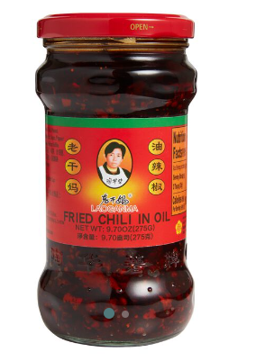

# Beef and Bellpeppers

"You said bell peppers and beef. There's no beef in here. So you wouldn't really call it bell peppers and beef, now, would you?"

"Yes I would."

"Well it's not!"

"It is when you're broke, alright?"

Makes four servings, each with ~35% daily sodium content.

## Ingredients
- Trader Joe's pre-marinated flank steak (Sesame/Teriyaki/Whatever they call the East Asian marinade.)
- Yellow or sweet onion (x2, large)
- Shallot (1x)
- Green bell peppers (4x)
- Ginger paste (or fresh ginger root, microplaned into a paste)
- Fresh garlic (4 cloves)
- Sesame oil
- Avocado oil (olive oil works in a pinch)
- Mirin or Shaoxing cooking wines
- Rice wine vinegar
- EITHER (low sodium soy sauce, brown sugar, and honey) OR (semi-sweet teriyaki sauce). Teriyaki sauce recommended.
- EITHER Lao Gan Ma (see appendix) chili crisp OR red chili flakes.
- Monosodium Glutamate (MSG) powder
- Sesame seeds
- Green onions (4-5x)
- Salt and pepper
- Corn starch

## Implements
- Cutting board and chef's knife
- Wok or stainless-steel pan
- Jar with lid, at least 12oz
- Flat-ended wooden spoon (spatula?)

## Prep
If you want to eat this with rice, get that going now. I won't mention it again.

0. Clear counter space and get everything out. You will have to move quickly at times. Mis-en-place is important.
1. Remove pre-marinaded steak from packaging. Save as much of the marinade in a bowl as possible. Cut the steak against the grain into pieces approximately 1/3 inch thick. Put cut steak into bowl with reserved marinade.
2. Finely chop garlic and shallots.
3. Add half of the chopped garlic and all of the chopped shallots to the beef marinade bowl. Add about one tablespoon of ginger paste. Sprinkle about 1 tablespoon of corn starch per half-pound of beef into the bowl. Mix with hands thoroughly and let rest at room temperature. 
4. Cut onions into semi-thick half-rings. Cut bellpeppers into approximately the same shape and size. Chop green onions into thin rings and divide into two groups -- the greenest third of the green onion will be for garnish, the other two thirds for cooking.

### The Sauce
After each step, lid the jar and shake thoroughly to combine. You want to taste as you go, and you need it mixed to taste.

0. IF YOU AREN'T USING TERIYAKI SAUCE, warm up about 1/4 cup of honey in the microwave until runny, then combine IN YOUR LIDDED JAR with about 1/4 cup of LOW-SODIUM soy sauce. Add half a cup of water, a teaspoon of corn starch, and a teaspoon of brown sugar, and shake to combine thoroughly. OTHERWISE add one cup of teriyaki sauce to the lidded jar. Set aside.
1. If using Lao Gan Ma, add ~3 tablespoons to your lidded jar (which should have either teriyaki sauce or your honey/soy mix already). Otherwise, add ~1 tablespoon of chili flake, less if you're a wimp, more if you like flavor.
2. Add ~3 tablespoons of sesame oil.
3. Add a generous splash of cooking wine.
4. Add one tablespoon ginger paste.
5. Add pepper and MSG to taste.
6. Add rice wine vinegar to taste. You want the sauce to be bright, but not too acidic. 

Final sauce should not be thick, but shouldn't be too thin, either, and should be thoroughly combined.

## Begin Cooking
0. Set wok/pan on stove, add ~2 tablespoons of avocado/olive oil, set temperature to Medium, and let warm up. If the oil begins to smoke, turn the temperature down. We want the oil hot and ready when we need it, but we don't want to smoke it. LET IT GET TO TEMPERATURE BEFORE PROCEEDING.
1. Add onions and bell peppers to the pan. It should lightly sizzle. IF IT DOESN'T, TAKE IT OUT AND WAIT. Add ~2 tablespoons MSG. Salt and pepper generously. Stir periodically. Let them cook this way until the onions are wilted and slightly translucent, and slightly sweet to the taste. The bell peppers should finish at the same time, and should be semi-cooked, semi-sweet, soft but still with a little bit of a crunch left.
2. Add remaining garlic, lower two-thirds of green onions, and one tablespoon of ginger paste to the wok/pan. Turn heat up to medium-high and stir every 15 seconds. We want to avoid browning anything, but we want to give the aromatics time to cook in. Cook this way for about ~2 minutes.
3. Remove vegetals from heat (put in a bowl or something), leaving the oil/fond in the pan. Turn heat up to high and add beef piece-by-piece. Leave the marinade in the bowl for now.
4. Let beef cook on high for about 2.5 minutes, then flip a single piece to check. It should be charring but not charred; brown, not grey or black. If that looks good, flip them all to the other side. If not, wait til it does.
5. Let flipped beef sit for ~1 minute, then deglase the pan with ~1/4 cup of cooking wine. Stir vigorously, using your wooden spatula to dislodge as much of the fond (food bits browned and stuck to pan) as possible while there's still wine to lubricate with.
6. Immediately add the reserved marinade and stir. Add the reserved vegetals and stir. Let everything come back up to temperature, then kill the heat to Low and add the sauce from the jar you prepped ahead. Stir vigorously so everything is coated. If the sauce is runnier than you'd like, titrate ~1 tablespoon of corn starch into the mix, stir thoroughly, and repeat if still too runny. You want it a little runny.
7. Remove from heat, turn off stove, let sit ~5 minutes before serving.

## Serve
Serve with sesame seeds, a splash of sesame oil, and the green third of your green onions. Goes well over white rice.

## Appendix
Lao Gan Ma is a chili crisp made by pouring hot oil on top of red chili flakes and other seasonings. You can find it in any grocery store that has a Chinese section. It's a super common condiment and not particularly spicy.

